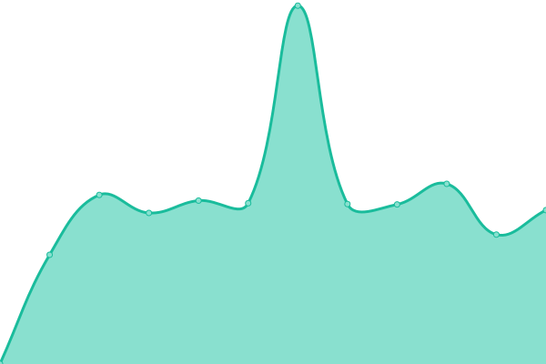

# [📈 Live Status](https://status.elara.ws): <!--live status--> **🟧 Partial outage**

This repository contains the open-source uptime monitor and status page for [Upptime](https://upptime.js.org), powered by [Upptime](https://github.com/upptime/upptime).

With [Upptime](https://upptime.js.org), you can get your own unlimited and free uptime monitor and status page, powered entirely by a GitHub repository. We use [Issues](https://github.com/upptime/upptime/issues) as incident reports, [Actions](https://github.com/Elara6331/uptime/actions) as uptime monitors, and [Pages](https://status.elara.ws) for the status page.

<!--start: status pages-->
<!-- This summary is generated by Upptime (https://github.com/upptime/upptime) -->
<!-- Do not edit this manually, your changes will be overwritten -->
<!-- prettier-ignore -->
| URL | Status | History | Response Time | Uptime |
| --- | ------ | ------- | ------------- | ------ |
|  [Gitea](https://gitea.elara.ws) | 🟩 Up | [gitea.yml](https://github.com/Elara6331/uptime/commits/HEAD/history/gitea.yml) | 

 2270ms
     
 | 

<a href="https://status.elara.ws/history/gitea">99.29%</a>
    

|  [Site](https://www.elara.ws) | 🟩 Up | [site.yml](https://github.com/Elara6331/uptime/commits/HEAD/history/site.yml) | 

 1754ms
     
 | 

<a href="https://status.elara.ws/history/site">99.29%</a>
    

|  [LURE](https://lure.sh) | 🟥 Down | [lure.yml](https://github.com/Elara6331/uptime/commits/HEAD/history/lure.yml) | 

 0ms
     
 | 

<a href="https://status.elara.ws/history/lure">0.00%</a>
    

|  [Woodpecker CI](https://ci.elara.ws) | 🟥 Down | [woodpecker-ci.yml](https://github.com/Elara6331/uptime/commits/HEAD/history/woodpecker-ci.yml) | 

 0ms
     
 | 

<a href="https://status.elara.ws/history/woodpecker-ci">0.00%</a>
    

|  [SearXNG](https://search.elara.ws) | 🟩 Up | [sear-xng.yml](https://github.com/Elara6331/uptime/commits/HEAD/history/sear-xng.yml) | 

 857ms
     
 | 

<a href="https://status.elara.ws/history/sear-xng">98.66%</a>
    

|  [MinIO (S3)](https://minio.elara.ws) | 🟥 Down | [min-io-s3.yml](https://github.com/Elara6331/uptime/commits/HEAD/history/min-io-s3.yml) | 

 0ms
     
 | 

<a href="https://status.elara.ws/history/min-io-s3">0.00%</a>
    

|  [Matrix](https://matrix.arsenm.dev) | 🟥 Down | [matrix.yml](https://github.com/Elara6331/uptime/commits/HEAD/history/matrix.yml) | 

 559ms
     
 | 

<a href="https://status.elara.ws/history/matrix">0.00%</a>
    

|  GZD Matrix | 🟥 Down | [gzd-matrix.yml](https://github.com/Elara6331/uptime/commits/HEAD/history/gzd-matrix.yml) | 

 3098ms
     
 | 

<a href="https://status.elara.ws/history/gzd-matrix">97.09%</a>
    

<!--end: status pages-->

[**Visit our status website →**](https://status.elara.ws)

## 📄 License

- Powered by: [Upptime](https://github.com/upptime/upptime)
- Code: [MIT](./LICENSE) © [Upptime](https://upptime.js.org)
- Data in the `./history` directory: [Open Database License](https://opendatacommons.org/licenses/odbl/1-0/)
